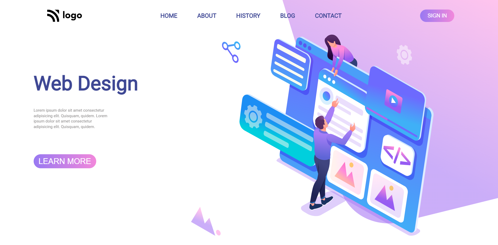

# Assignment 8

[Live Link](https://lambent-panda-7c243e.netlify.app/)

- Skills Gained

  - Learned to create linear-gradient background color.

---

## Time taken to finish this project

- 2 hour to complete it.

#### Screenshot

